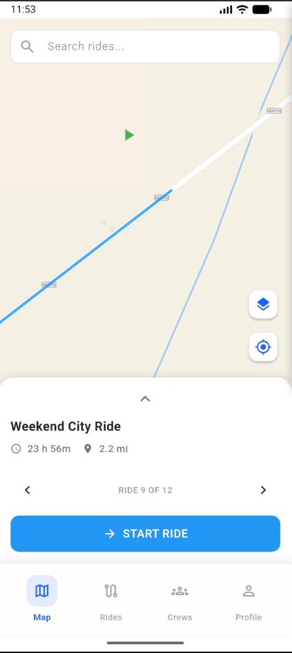
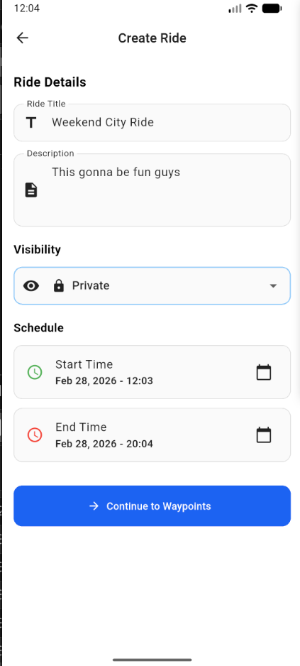
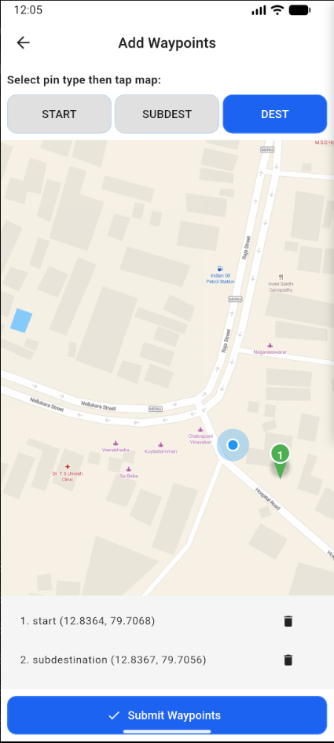
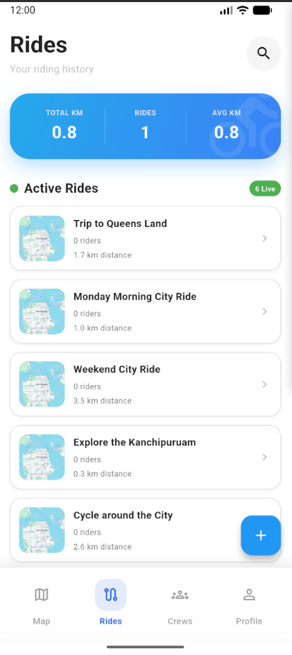
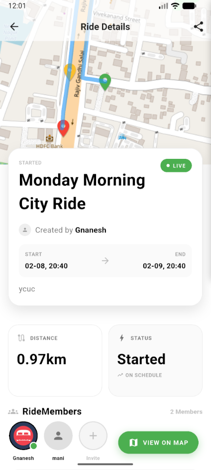
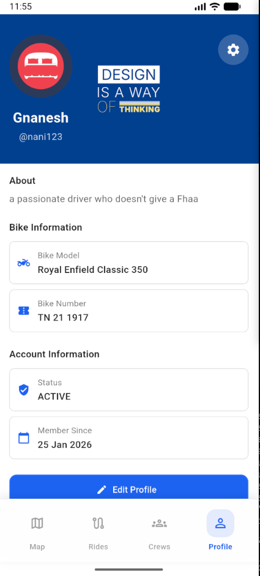

# CrewRide - Flutter App

A collaborative ride-sharing application built with Flutter that lets users create, join, and manage group rides.

## Screenshots

| | | |
|---|---|---|
|  |  |  |
| **Home Map Screen** | **Create Rides** | **Waypoint Selection** |
| View rides on an interactive map | Plan and create new rides with waypoints | Set multiple waypoints for your route |
| | | |
|  |  |  |
| **Rides Management** | **Ride Details** | **User Profile** |
| Track all your rides | View detailed information about each ride | Manage your profile |

## Setup

1. Clone the repository
2. Install Flutter dependencies:
   ```bash
   flutter pub get
   ```
3. Configure `.env` file with required API keys
4. Run the app:
   ```bash
   flutter run
   ```

## Requirements

- Flutter SDK
- Dart 3.0+
- Android SDK / Xcode (for respective platforms)
